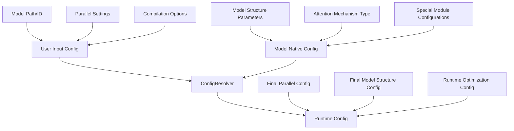
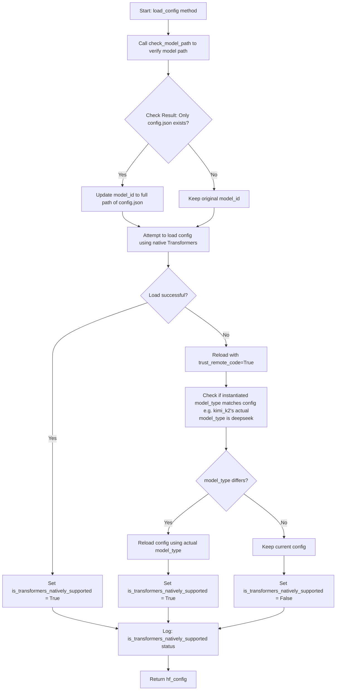
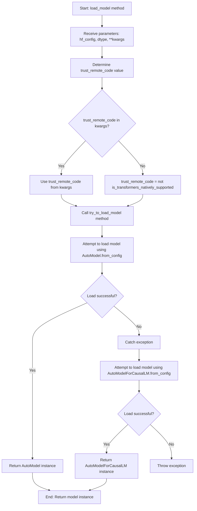

# RFC: General Model and Configuration Loading Optimization Proposal

## Metadata

| Item | Details |
|:-----|:--------|
| **Status** | Approved |
| **Author** | wqh17101 |
| **Creation Date** | 2025-12-19 |
| **Related Links** | [1. Optimize model and config loading logic 2. Add model_type support for mapping (remove model_id mapping later)](https://gitcode.com/Ascend/msit/pull/4845)  [Add Xiaomi model loading, fix reload config logic & adaptive LMHead addition & DT synchronization & optimize quantization logic](https://gitcode.com/Ascend/msit/pull/4880) |

---

## 1. Overview

This proposal aims to address the insufficient capabilities in model loading and general configuration loading within the project. The solution focuses on optimizing the architecture and configuration, removing redundant configurations, adopting adaptive methods for automatic configuration whenever possible, and maximizing the reuse of transformers library capabilities.

## 2. Detailed Design

- To ensure single responsibility, we designed an independent `AutoModelConfigLoader` class to implement the functions of loading models, loading general configurations.
- For model structure registration and mapping, `model_type` should be used as the key instead of `model_id`.
- `ModelConfig` refactoring

### 2.1 Implementation Plan

#### 2.1.1 General Configuration Files

For standard `config.json`, we use `AutoConfig.from_pretrained` method for reading.

#### 2.1.2 General Model Loading

We use `AutoModel` or `AutoModelForCausalLM` for loading, where `AutoModelForCausalLM = AutoModelWithLMHead`.

### 2.2 Alternative Solutions

1. **Maintain Status Quo**: Continue managing model and config loading functions across various modules
   - **Disadvantages**: Will lead to more circular dependency issues, difficult to maintain and extend

2. **Use Inheritance Instead of Composition**: Extend model loading functionality through inheritance
   - **Disadvantages**: Increases complexity of class hierarchy, less flexible

### 2.3 Solution Analysis

#### Advantages of Proposed Solution:

1. Solves circular dependency issues between modules, improving code quality
2. Improves model type recognition, enhancing system compatibility
3. Follows single responsibility principle, improving code maintainability
4. Adopts layered architecture design, facilitating extension and maintenance
5. Supports configuration-driven approach, enhancing system flexibility

#### Limitations of Proposed Solution:

1. Requires updating existing model and config loading usage patterns
2. Adds new modules, requiring corresponding documentation and training
3. Requires large-scale refactoring of existing code

## 3. Implementation Plan

### General config and model loading refactoring

- [x] Extract a model loader class for responsibility separation
- [x] Support model loading for various scenarios
- [ ] Use model_type instead of model_id as the key for model structure mapping dictionary

### ModelConfig refactoring

- [x] Remove enable_lmhead
- [x] Remove disable_auto_map
- [ ] Remove hf_config_json
- [ ] Continue optimization based on changes

### User Interaction Refactoring

- [ ] Continue optimization based on changes

---

## Technical Implementation Details

### Core Components

#### AutoModelConfigLoader
This class serves as the central hub for all configuration and model loading operations:

- **Configuration Loading**: Handles various configuration formats and sources
- **Model Loading**: Supports different model architectures and loading strategies

### Key Design Principles

1. **Single Responsibility**: Each component has a clear, focused purpose
2. **Extensibility**: New model architectures can be easily integrated
3. **Compatibility**: Works synergistically with existing transformers library features
4. **Performance**: Optimized for production environments
5. **Maintainability**: Clear separation of concerns reduces complexity

### Migration Strategy

Implementation follows a phased approach:
1. Core infrastructure setup
2. Configuration system unification
3. Model loading integration
4. User interface optimization
5. Performance validation and tuning

This RFC represents a significant architectural improvement that will enhance system flexibility, maintainability, and performance while providing better support for different model types.