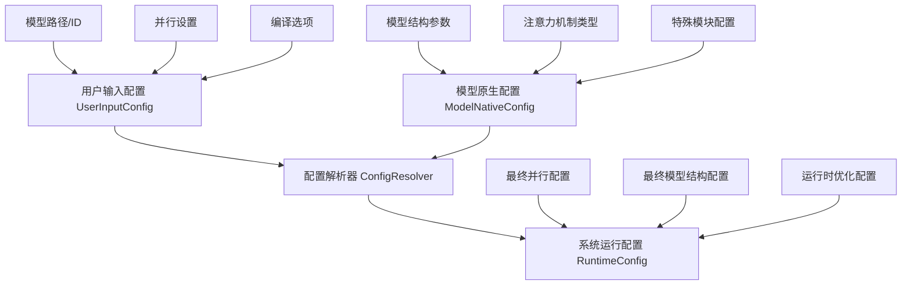
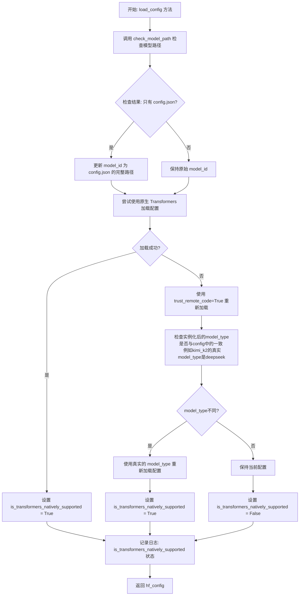
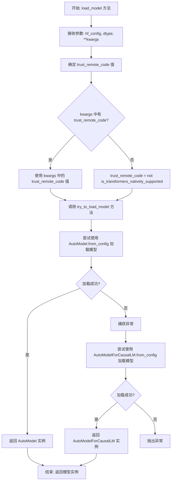

# RFC: 通用模型加载与配置加载优化方案

## 元数据

| 项目 | 内容 |
|:-----|:--------|
| **状态** | 已批准 |
| **作者** | wqh17101 |
| **创建日期** | 2025-12-19 |
| **相关链接** | [1.优化模型和配置加载逻辑 2.映射增加model_type支持（后续移除model_id的映射）](https://gitcode.com/Ascend/msit/pull/4845)  [增加小米模型加载，修正reload config逻辑&自适应增加LMHead & DT 同步适配&优化量化逻辑](https://gitcode.com/Ascend/msit/pull/4880) |

---

## 1. 概述

本提案旨在解决项目中的模型加载和通用配置加载能力不足的问题。方案专注于优化架构和配置，删除冗余配置，尽可能采用自适应方法进行自动配置，并最大化复用transformers库的能力。

## 2. 详细设计

- 为确保职责单一，我们设计了一个独立的`AutoModelConfigLoader`类来实现加载模型、加载通用配置的功能。
- 对于模型结构的注册和映射，应该采用`model_type`作为键值而非`model_id`。
- `ModelConfig`重构

### 2.1 实现方案

#### 2.1.1 通用配置文件

对于标准的`config.json`，我们使用`AutoConfig.from_pretrained`方法进行读取。

#### 2.1.2 通用模型加载

我们使用`AutoModel`或`AutoModelForCausalLM`进行加载，两者的区别在于`AutoModelForCausalLM = AutoModelWithLMHead`。

### 2.2 替代方案

1. **保持现状**：继续在各个模块中分散管理模型和配置加载功能
   - **缺点**：会导致更多的循环依赖问题，难以维护和扩展

2. **使用继承而非组合**：通过继承的方式扩展模型加载功能
   - **缺点**：增加了类层次结构的复杂性，不够灵活

### 2.3 方案分析

#### 主推方案优点：

1. 解决了模块间的循环依赖问题，提高了代码质量
2. 改进了模型类型识别，提高了系统的兼容性
3. 遵循单一职责原则，提高了代码的可维护性
4. 采用分层架构设计，便于扩展和维护
5. 支持配置驱动，提高了系统的灵活性

#### 主推方案局限性：

1. 需要更新现有的模型和配置加载使用方式
2. 增加了新的模块，需要相应的文档和培训
3. 需要对现有代码进行较大规模的重构

## 3. 实施计划

### 通用config和model加载改造

- [x] 抽取一个模型加载类，职责分离
- [x] 支持各种场景的模型加载
- [ ] 使用model_type而非model_id作为模型结构映射字典的key
- [ ] 统一使用ModelRunner
- [ ] generate_input 归一
### ModelConfig重构

- [x] 删除enable_lmhead
- [x] 删除disable_auto_map
- [x] 删除hf_config_json
- [ ] 根据变化持续优化

### 用户交互重构

- [ ] 根据变化持续优化

---

## 技术实现细节

### 核心组件

#### AutoModelConfigLoader
此类作为所有配置和模型加载操作的中心枢纽：

- **配置加载**：处理各种配置格式和来源
- **模型加载**：支持不同的模型架构和加载策略

### 关键设计原则

1. **单一职责**：每个组件都有明确、专注的用途
2. **可扩展性**：新模型架构可以轻松集成
3. **兼容性**：与现有transformers库功能协同工作
4. **性能**：针对生产环境优化
5. **可维护性**：清晰的关注点分离降低了复杂性

### 迁移策略

实现遵循分阶段方法：
1. 核心基础设施搭建
2. 配置系统统一
3. 模型加载集成
4. 用户界面优化
5. 性能验证和调优

本RFC代表了重大的架构改进，将增强系统的灵活性、可维护性和性能，同时为不同模型类型提供更好的支持。