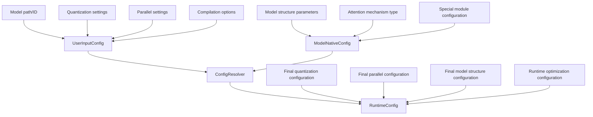
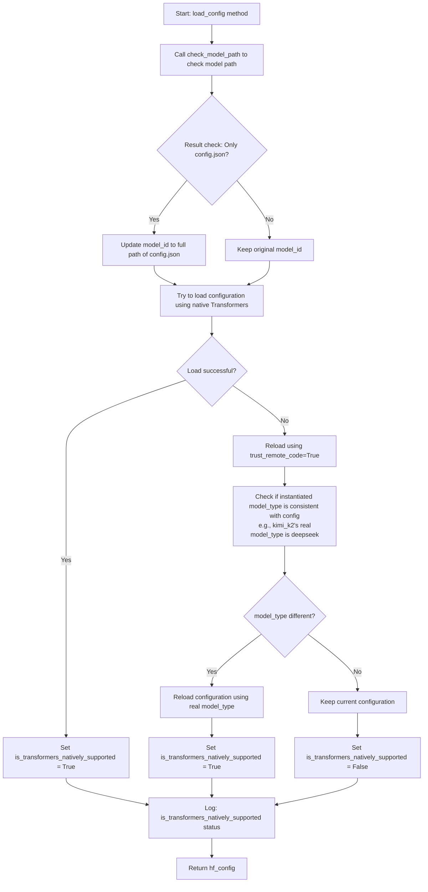
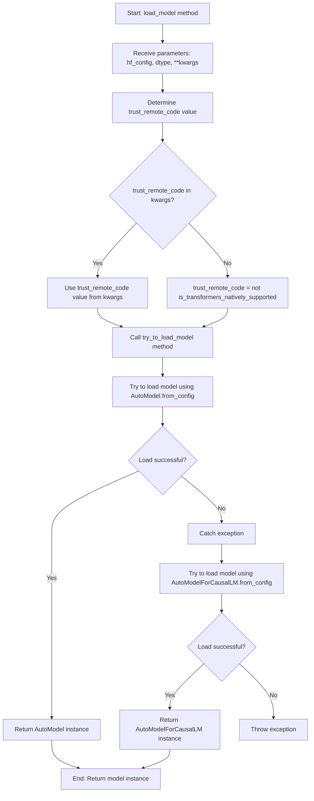
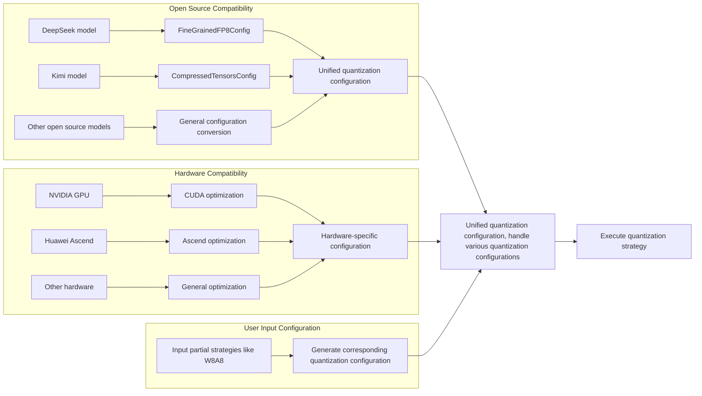
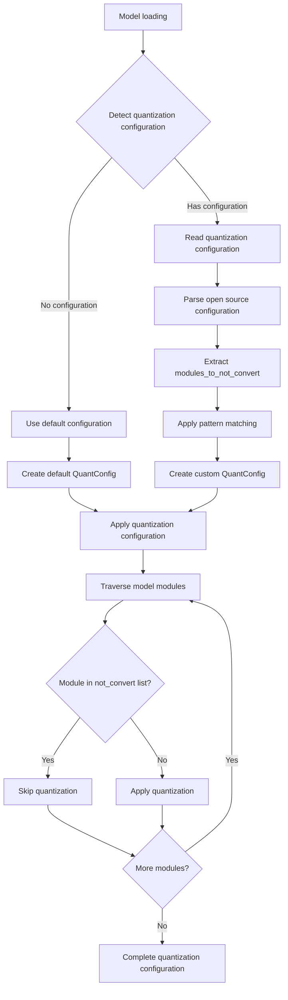
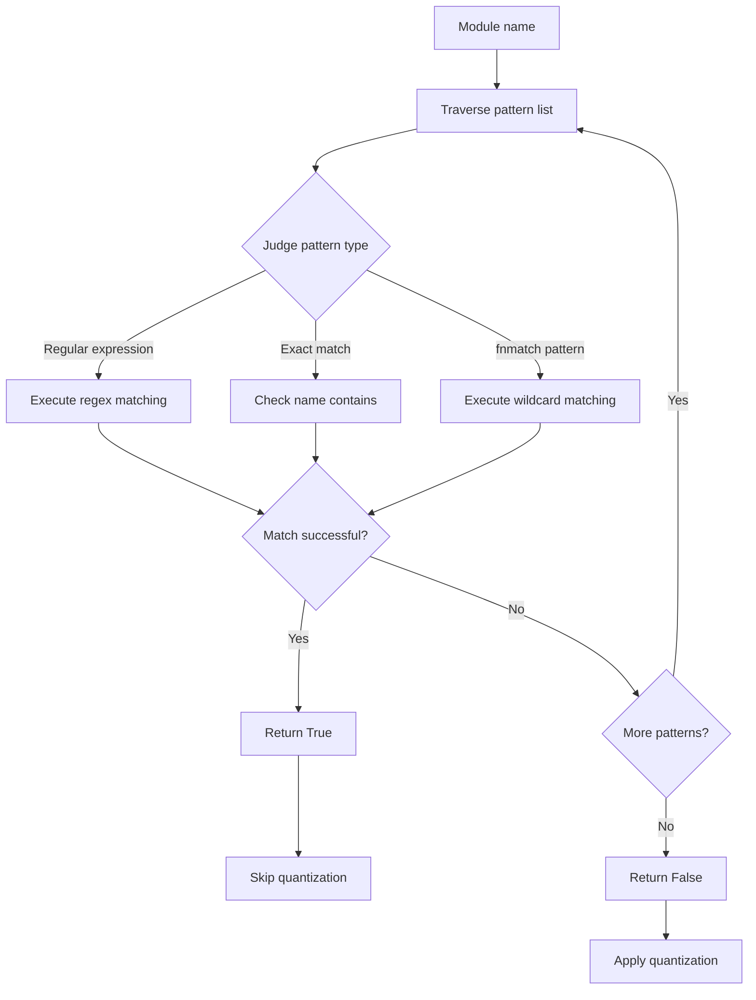

# RFC: Model General Configuration Loading Optimization and Unified Quantization Configuration System Design and Implementation Plan

## Metadata

| Item | Content |
|:-----|:--------|
| **Status** | Accepted |
| **Author(s)** | wqh17101 |
| **Creation Date** | 2025-12-19 |
| **Related Links** | [1. Optimize model and configuration loading logic 2. Add model_type support to mapping (subsequent removal of model_id mapping)](https://gitcode.com/Ascend/msit/pull/4845)  [Add Xiaomi model loading, fix reload config logic & adaptive LMHead & DT sync adaptation & optimize quantization logic](https://gitcode.com/Ascend/msit/pull/4880) |

---

## 1. Overview

This proposal aims to address insufficient model loading, general configuration loading, and quantization configuration loading capabilities in the project. It focuses on optimizing architecture and configurations, removing redundant configurations, adopting adaptive methods for automatic configuration wherever possible, and maximizing the reuse of capabilities from the transformers library.

## 2. Detailed Design

- To ensure single responsibility, we design a separate class `AutoModelConfigLoader` to implement the functionality of loading models, loading general configurations, and loading quantization configurations.
- Additionally, for quantization-related configurations, we need to design a `TensorCastQuantConfig` to unify quantization configurations from different sources, and a `Quantizer` to implement various quantization functions.
- For model structure registration and mapping, `model_type` should be used as the key rather than `model_id`.
- `ModelConfig` refactoring

### 2.1 Implementation

#### 2.1.1 General Configuration File

For a standard `config.json`, we use the `AutoConfig.from_pretrained` method for reading.

#### 2.1.2 General Model Loading

We use `AutoModel` or `AutoModelForCausalLM` for loading, where the difference is that `AutoModelForCausalLM = AutoModelWithLMHead`.

#### 2.1.3 Quantization Configuration and Quantization Class (To Be Completed)

We need to support loading open-source quantization configurations as well as Ascend-specific quantization configurations. Different quantization methods have their own quantizers, which leads to incompatibility between their respective quantization configuration files. Therefore, we need a common quantization class to parse various different configurations and unify them into a common format.

Current open-source quantization configurations mainly include `FineGrainedFP8Config` and `CompressedTensors`.

##### 2.1.3.1 Quantization Scenarios

1. **Open Source Compatibility**:
   - Support quantization configurations for mainstream open-source models
   - Provide configuration conversion tools
   - Design APIs referencing open-source standards

2. **Hardware Compatibility**:
   - Support quantization features for different hardware platforms
   - Provide hardware-specific optimization options
   - Automatically detect hardware capabilities and adjust configurations

##### 2.1.3.2 Quantization Process

The workflow of the pattern matching system is as follows:

### 2.2 Alternatives Considered

1. **Maintain Status Quo**: Continue to manage quantization-related functions dispersed across various modules
   - **Cons**: Will lead to more circular dependency issues, difficult to maintain and extend

2. **Use Inheritance Instead of Composition**: Extend quantization configuration functionality through inheritance
   - **Cons**: Increases complexity of class hierarchy, not flexible enough

3. **Only Support Exact Name Matching**: Do not implement fnmatch and regex matching
   - **Cons**: Limits flexibility of module exclusion functionality, cannot meet complex matching requirements

4. **Hardcode Exclusion List**: Hardcode exclusion lists in code
   - **Cons**: Lacks flexibility, difficult to adapt to different models and scenarios

### 2.3 Pros and Cons

#### Advantages of the Proposed Solution:

1. Resolves circular dependency issues between modules, improving code quality
2. Provides flexible module exclusion mechanism, supporting multiple matching patterns
3. Enhanced support for open-source quantization configuration formats
4. Improved model type recognition, increasing system compatibility
5. Adheres to single responsibility principle, improving code maintainability
6. Uses layered architecture design, facilitating extension and maintenance
7. Supports configuration-driven approach, increasing system flexibility

#### Limitations of the Proposed Solution:

1. Requires updating existing quantization configuration usage methods
2. Adds new modules, requiring corresponding documentation and training
3. Regular expression matching may have performance overhead
4. Requires large-scale refactoring of existing code

## 3. Plan

### General Config and Model Loading Refactoring

- [x] Extract a model loading class, separating responsibilities
- [x] Support various scenarios of model loading
- [ ] Use model_type instead of model_id as key for model structure mapping dictionary

### General Quantization System Refactoring

- [x] Support reading open-source quantization configurations
- [ ] Extract Quantizer class and TensorCastQuantConfig class
- [ ] Integrate with existing system, modify logic

### ModelConfig Refactoring

- [x] Delete enable_lmhead
- [x] Delete disable_auto_map
- [ ] Delete hf_config_json
- [ ] Continuously optimize based on changes

### User Interaction Refactoring

- [ ] Continuously optimize based on changes

---

## Technical Implementation Details

### Core Components

#### AutoModelConfigLoader
This class serves as the central hub for all configuration and model loading operations:

- **Configuration Loading**: Handles various config formats and sources
- **Model Loading**: Supports different model architectures and loading strategies
- **Quantization Integration**: Bridges between different quantization approaches

#### TensorCastQuantConfig
A unified configuration format that:
- Converts various open-source quantization configs to a common format
- Provides hardware-specific optimization parameters
- Supports adaptive configuration based on detected hardware capabilities

#### Quantizer
The main quantization engine that:
- Applies quantization transformations to model weights and activations
- Supports multiple quantization schemes (W8A8, FP8, etc.)
- Provides pattern-based module exclusion

### Key Design Principles

1. **Single Responsibility**: Each component has a clear, focused purpose
2. **Extensibility**: New quantization methods can be easily integrated
3. **Compatibility**: Works with existing transformers library functionality
4. **Performance**: Optimized for production environments
5. **Maintainability**: Clean separation of concerns reduces complexity

### Migration Strategy

The implementation follows a phased approach:
1. Core infrastructure setup
2. Configuration system unification
3. Quantization system integration
4. User interface optimization
5. Performance validation and tuning

This RFC represents a significant architectural improvement that will enhance the system's flexibility, maintainability, and performance while providing better support for diverse model types and quantization strategies.