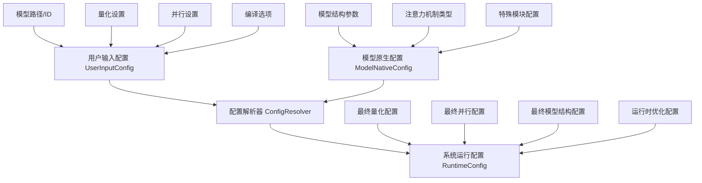
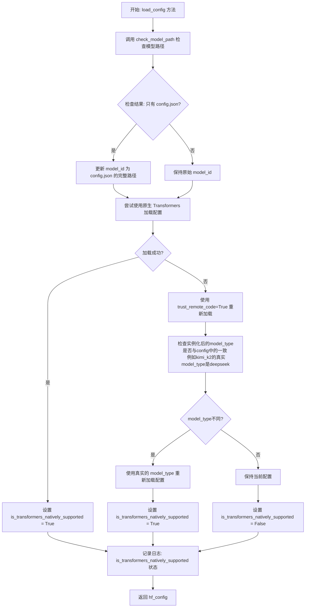
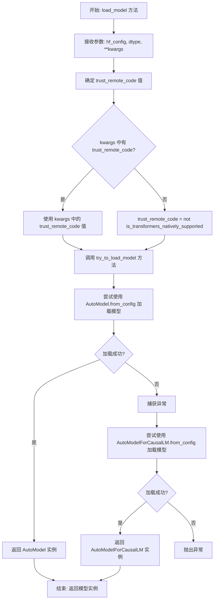
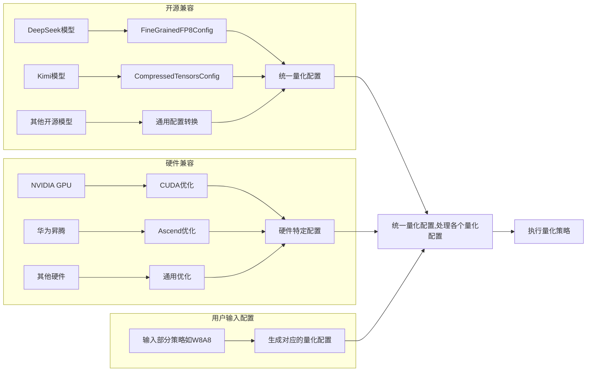
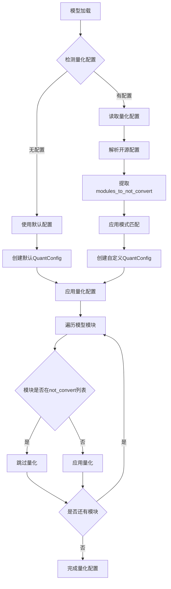
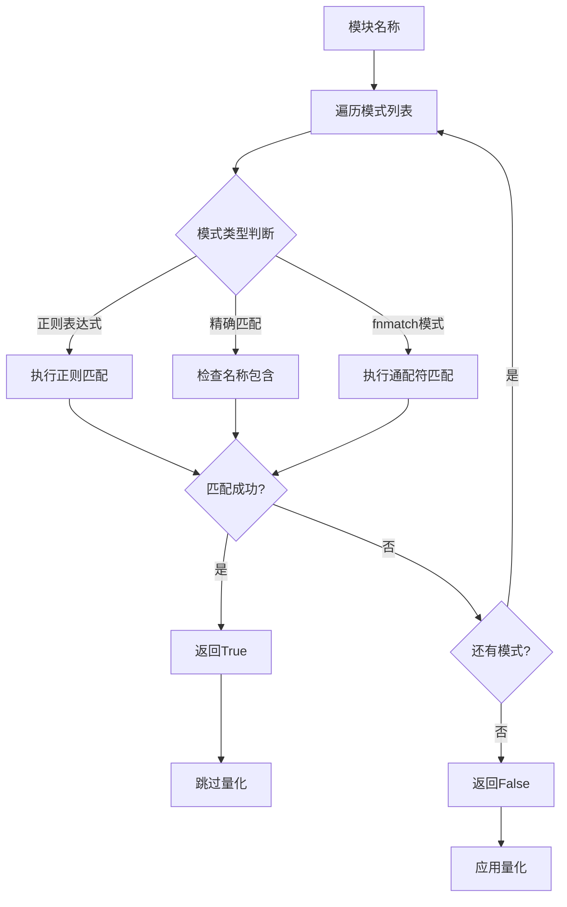

# RFC: 模型通用配置加载优化与统一量化配置系统设计与实现方案

## Metadata (元数据)

| Item / 项目                | Content / 内容                                                                                                                                                                                                  |
|:-------------------------|:--------------------------------------------------------------------------------------------------------------------------------------------------------------------------------------------------------------|
| **Status / 状态**          | Accepted (已批准)                                                                                                                                                                                                |
| **Author(s) / 作者**       | wqh17101                                                                                                                                                                                                      |
| **Creation Date / 创建日期** | 2025-12-19                                                                                                                                                                                                    |
| **Related Links / 相关链接** | [1.优化模型和配置加载逻辑 2.映射增加model_type支持（后续移除model_id的映射）](https://gitcode.com/Ascend/msit/pull/4845)   [增加小米模型加载，修正reload config逻辑&自适应增加LMHead & DT 同步适配&优化量化逻辑](https://gitcode.com/Ascend/msit/pull/4880) |

---

## 1. Overview（概述）

本提案旨在解决项目中的模型加载、通用加载、量化配置加载能力不足的问题，优化架构和配置，删除冗余的配置，部分配置采用自适应的方法自动配置，尽可能复用transformers库中的能力。

## 2. Detailed Design（详细设计）

- 为保障职责单一，我们设计了一个单独的类 AutoModelConfigLoader 来实现 加载模型、加载通用配置、加载量化配置的功能。
- 同时对于量化相关的配置，我们需要额外设计一个TensorCastQuantConfig 来统一不同来源的量化配置，以及一个 Quantizer
  来实现各种量化功能。
- 对于模型结构的注册和映射，应该采用model_type作为键值而非model_id。
- ModelConfig重构

### 2.1 Implementation（实现方案）

#### 2.1.1 通用配置文件

对于一个标准的config.json，我们使用 AutoConfig.from_pretrained方法进行读取。

### 2.1.2 通用模型加载

我们使用AutoModel或AutoModelForCausalLM进行加载，两者的区别在于 AutoModelForCausalLM = AutoModelWithLMHead

### 2.1.3 量化配置与量化类（待完善）

我们需要支持加载开源的量化配置以及昇腾特有的量化配置，不同的量化方法有自己的quantizer这就导致各自的量化配置文件无法统一，因此我们需要一个common的量化类来解析各种不同的配置，并把他们统一成一个公共的。  
当前开源的量化配置主要有FineGrainedFP8Config和CompressedTensors

#### 2.1.3.1 量化场景

1.**开源兼容**：

- 支持主流开源模型的量化配置
- 提供配置转换工具
- 参考开源标准设计API

2.**硬件兼容**：

- 支持不同硬件平台的量化特性
- 提供硬件特定的优化选项
- 自动检测硬件能力并调整配置

#### 2.1.3.2 量化流程

模式匹配系统的工作流程如下：

### 2.2 Alternatives Considered（替代方案）

1. **保持现状**：继续在各个模块中分散管理量化相关功能
    - 缺点：会导致更多的循环依赖问题，难以维护和扩展

2. **使用继承而非组合**：通过继承的方式扩展量化配置功能
    - 缺点：增加了类层次结构的复杂性，不够灵活

3. **仅支持精确名称匹配**：不实现fnmatch和正则表达式匹配
    - 缺点：限制了模块排除功能的灵活性，无法满足复杂的匹配需求

4. **硬编码排除列表**：将排除列表硬编码在代码中
    - 缺点：缺乏灵活性，难以适应不同的模型和场景

### 2.3 Pros and Cons（方案分析）

#### 主推方案优点：

1. 解决了模块间的循环依赖问题，提高了代码质量
2. 提供了灵活的模块排除机制，支持多种匹配模式
3. 增强了对开源量化配置格式的支持
4. 改进了模型类型识别，提高了系统的兼容性
5. 遵循单一职责原则，提高了代码的可维护性
6. 采用分层架构设计，便于扩展和维护
7. 支持配置驱动，提高了系统的灵活性

#### 主推方案局限性：

1. 需要更新现有的量化配置使用方式
2. 增加了新的模块，需要相应的文档和培训
3. 正则表达式匹配可能存在性能开销
4. 需要对现有代码进行较大规模的重构

## 3. Plan（实施计划）

### 通用config和model加载改造

-[x] 抽取一个模型加载类，职责分离
-[x] 支持各种场景的模型加载

### 通用量化系统改造

-[x] 支持读取开源的量化配置
- [ ] 抽取一个 Quantizer类 和 TensorCastQuantConfig 类
-[ ] 对接现有系统，修改逻辑

### ModelConfig重构

-[x] 删除enable_lmhead
-[x] 删除disable_auto_map
-[ ] 删除hf_config_json
-[ ] 根据变化持续优化

### 用户交互重构

-[ ] 根据变化持续优化  

