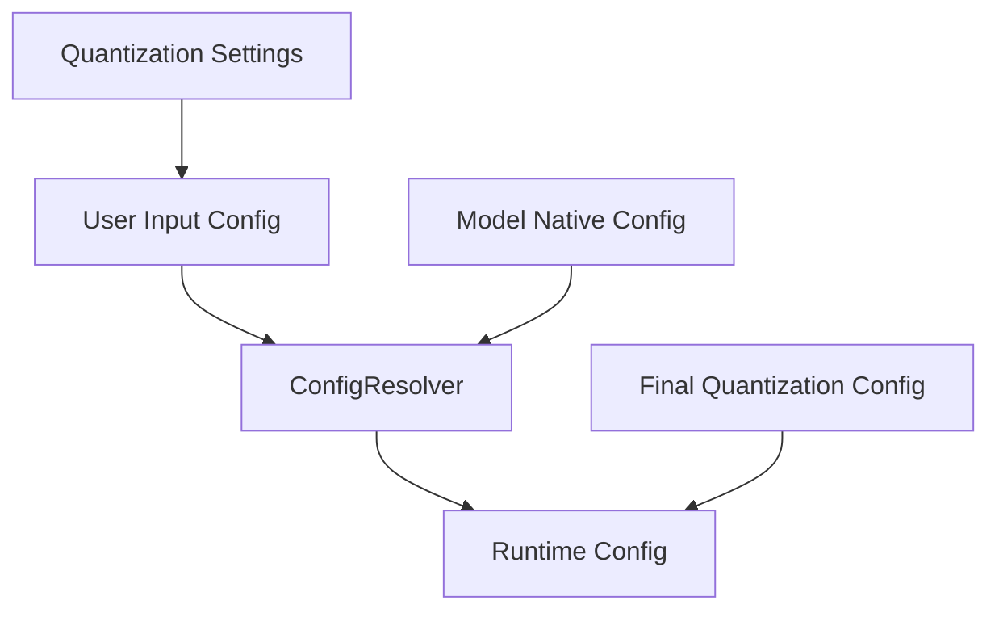
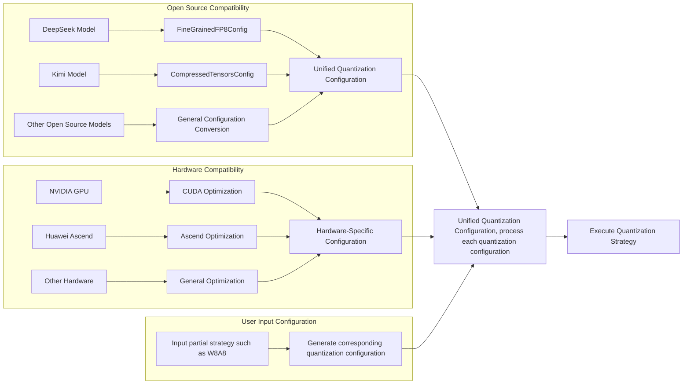
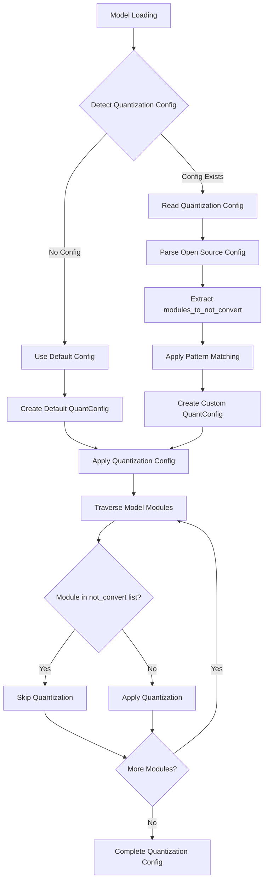
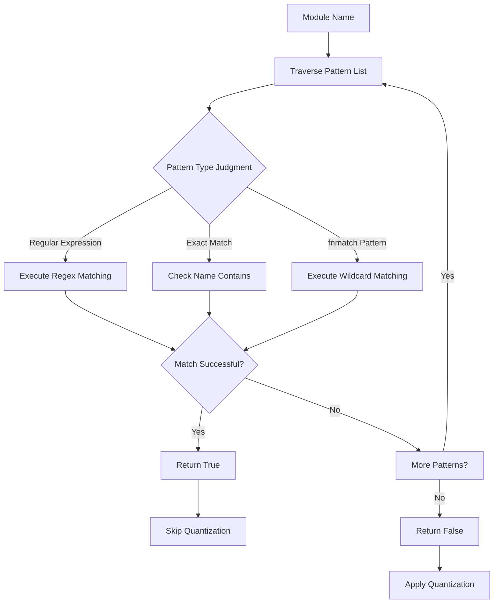

# RFC: Quantization Configuration System Optimization Proposal

## Metadata

| Item | Details |
|:-----|:--------|
| **Status** | Approved |
| **Author** | wqh17101 |
| **Creation Date** | 2025-12-19 |
| **Related Links** | [1. Optimize model and config loading logic 2. Add model_type support for mapping (remove model_id mapping later)](https://gitcode.com/Ascend/msit/pull/4845)  [Add Xiaomi model loading, fix reload config logic & adaptive LMHead addition & DT synchronization & optimize quantization logic](https://gitcode.com/Ascend/msit/pull/4880) |

---

## 1. Overview

This proposal aims to address the insufficient quantization configuration loading capabilities within the project. The solution focuses on optimizing the quantization configuration system, unifying quantization configurations from different sources, and maximizing the reuse of transformers library capabilities.

## 2. Detailed Design

- For quantization-related configurations, we need to design `TensorCastQuantConfig` to unify quantization configurations from different sources, and `Quantizer` to implement various quantization functions.

### 2.1 Implementation Plan

#### 2.1.1 Quantization Configuration and Quantizer Class

We need to support loading open-source quantization configurations as well as Ascend-specific quantization configurations. Different quantization methods have their own quantizers, which leads to incompatible quantization configuration files. Therefore, we need to create a universal quantization class to parse various configurations and unify them into a common format.

Current open-source quantization configurations mainly include `FineGrainedFP8Config` and `CompressedTensors`.

##### 2.1.1.1 Quantization Scenarios

1. **Open Source Compatibility**:
   - Supports quantization configurations of mainstream open-source models
   - Provides configuration conversion tools
   - Designs APIs with reference to open-source standards

2. **Hardware Compatibility**:
   - Supports quantization features of different hardware platforms
   - Provides hardware-specific optimization options
   - Automatically detects hardware capabilities and adjusts configurations

##### 2.1.1.2 Quantization Process

The workflow of the pattern matching system is as follows:

### 2.2 Alternative Solutions

1. **Maintain Status Quo**: Continue managing quantization-related functions across various modules
   - **Disadvantages**: Will lead to more circular dependency issues, difficult to maintain and extend

2. **Use Inheritance Instead of Composition**: Extend quantization configuration functionality through inheritance
   - **Disadvantages**: Increases complexity of class hierarchy, less flexible

3. **Only Support Exact Name Matching**: Do not implement fnmatch and regular expression matching
   - **Disadvantages**: Limits flexibility of module exclusion functionality, cannot meet complex matching requirements

4. **Hardcode Exclusion List**: Hardcode exclusion list in code
   - **Disadvantages**: Lacks flexibility, difficult to adapt to different models and scenarios

### 2.3 Solution Analysis

#### Advantages of Proposed Solution:

1. Solves circular dependency issues between modules, improving code quality
2. Provides flexible module exclusion mechanism supporting multiple matching patterns
3. Enhances support for open-source quantization configuration formats
4. Follows single responsibility principle, improving code maintainability
5. Adopts layered architecture design, facilitating extension and maintenance
6. Supports configuration-driven approach, enhancing system flexibility

#### Limitations of Proposed Solution:

1. Requires updating existing quantization configuration usage patterns
2. Adds new modules, requiring corresponding documentation and training
3. Regular expression matching may have performance overhead
4. Requires large-scale refactoring of existing code

## 3. Implementation Plan

### General Quantization System Refactoring

- [x] Support reading open-source quantization configurations
- [ ] Extract a Quantizer class and TensorCastQuantConfig class
- [ ] Integrate with existing system, modify logic

---

## Technical Implementation Details

### Core Components

#### TensorCastQuantConfig
Unified configuration format with the following characteristics:

- Converts various open-source quantization configurations into a universal format
- Provides hardware-specific optimization parameters
- Supports adaptive configuration based on detected hardware capabilities

#### Quantizer
Main quantization engine with the following features:

- Applies quantization transformations to model weights and activations
- Supports multiple quantization schemes (W8A8, FP8, etc.)
- Provides pattern-based module exclusion

### Key Design Principles

1. **Single Responsibility**: Each component has a clear, focused purpose
2. **Extensibility**: New quantization methods can be easily integrated
3. **Compatibility**: Works synergistically with existing transformers library features
4. **Performance**: Optimized for production environments
5. **Maintainability**: Clear separation of concerns reduces complexity

### Migration Strategy

Implementation follows a phased approach:
1. Core infrastructure setup
2. Quantization system integration
3. Performance validation and tuning

This RFC represents a significant architectural improvement that will enhance system flexibility, maintainability, and performance while providing better support for different quantization strategies.