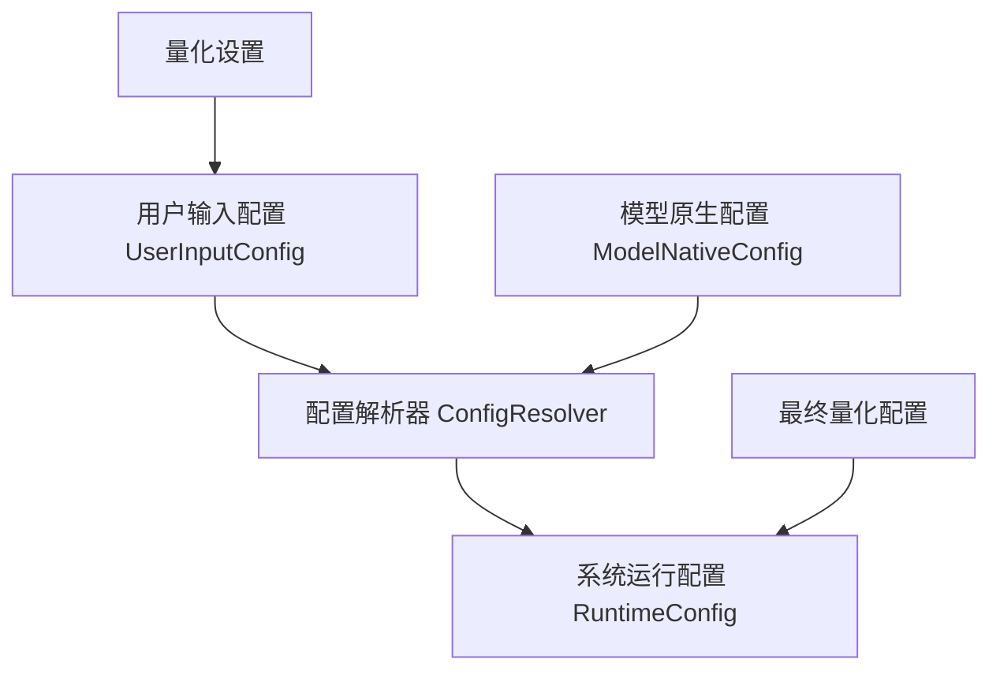
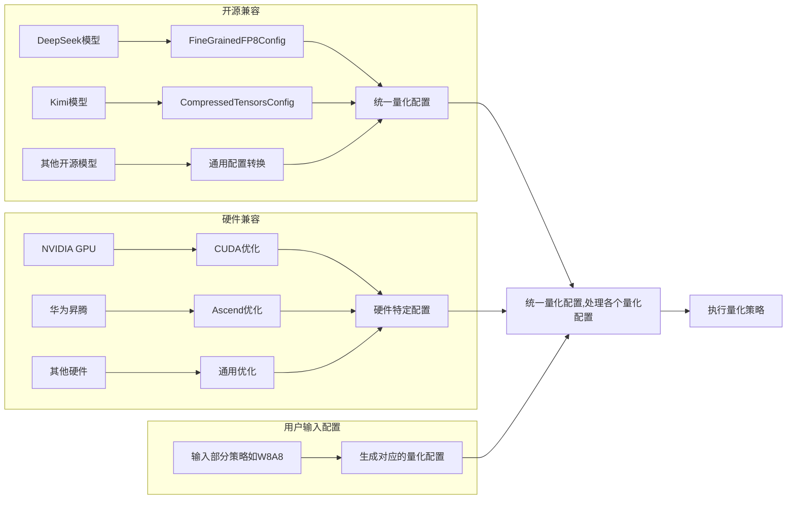
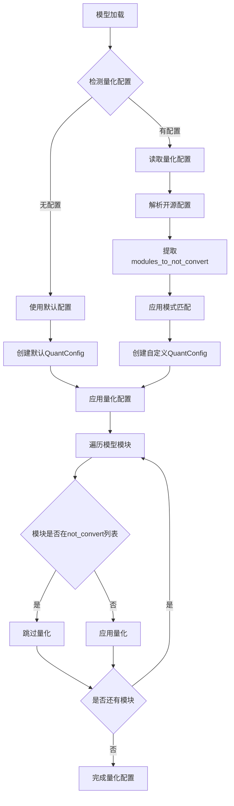
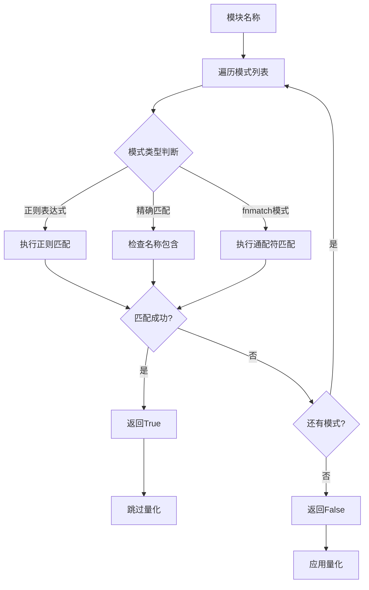

# RFC: 量化配置系统优化方案

## 元数据

| 项目 | 内容 |
|:-----|:--------|
| **状态** | 已批准 |
| **作者** | wqh17101 |
| **创建日期** | 2025-12-19 |
| **相关链接** | [1.优化模型和配置加载逻辑 2.映射增加model_type支持（后续移除model_id的映射）](https://gitcode.com/Ascend/msit/pull/4845)  [增加小米模型加载，修正reload config逻辑&自适应增加LMHead & DT 同步适配&优化量化逻辑](https://gitcode.com/Ascend/msit/pull/4880) |

---

## 1. 概述

本提案旨在解决项目中的量化配置加载能力不足的问题。方案专注于优化量化配置系统，统一不同来源的量化配置，并最大化复用transformers库的能力。

## 2. 详细设计

- 对于量化相关的配置，我们需要设计`TensorCastQuantConfig`来统一不同来源的量化配置，以及`Quantizer`来实现各种量化功能。

### 2.1 实现方案

#### 2.1.1 量化配置与量化类

我们需要支持加载开源的量化配置以及昇腾特有的量化配置。不同的量化方法有自己的quantizer，这就导致各自的量化配置文件无法统一，因此我们需要创建一个通用的量化类来解析各种不同的配置，并将它们统一成一个公共格式。

当前开源的量化配置主要包括`FineGrainedFP8Config`和`CompressedTensors`。

##### 2.1.1.1 量化场景

1. **开源兼容**：
   - 支持主流开源模型的量化配置
   - 提供配置转换工具
   - 参考开源标准设计API

2. **硬件兼容**：
   - 支持不同硬件平台的量化特性
   - 提供硬件特定的优化选项
   - 自动检测硬件能力并调整配置

##### 2.1.1.2 量化流程

模式匹配系统的工作流程如下：

### 2.2 替代方案

1. **保持现状**：继续在各个模块中分散管理量化相关功能
   - **缺点**：会导致更多的循环依赖问题，难以维护和扩展

2. **使用继承而非组合**：通过继承的方式扩展量化配置功能
   - **缺点**：增加了类层次结构的复杂性，不够灵活

3. **仅支持精确名称匹配**：不实现fnmatch和正则表达式匹配
   - **缺点**：限制了模块排除功能的灵活性，无法满足复杂的匹配需求

4. **硬编码排除列表**：将排除列表硬编码在代码中
   - **缺点**：缺乏灵活性，难以适应不同的模型和场景

### 2.3 方案分析

#### 主推方案优点：

1. 解决了模块间的循环依赖问题，提高了代码质量
2. 提供了灵活的模块排除机制，支持多种匹配模式
3. 增强了对开源量化配置格式的支持
4. 遵循单一职责原则，提高了代码的可维护性
5. 采用分层架构设计，便于扩展和维护
6. 支持配置驱动，提高了系统的灵活性

#### 主推方案局限性：

1. 需要更新现有的量化配置使用方式
2. 增加了新的模块，需要相应的文档和培训
3. 正则表达式匹配可能存在性能开销
4. 需要对现有代码进行较大规模的重构

## 3. 实施计划

### 通用量化系统改造

- [x] 支持读取开源的量化配置
- [ ] 抽取一个 Quantizer类 和 TensorCastQuantConfig 类
- [ ] 对接现有系统，修改逻辑

---

## 技术实现细节

### 核心组件

#### TensorCastQuantConfig
统一的配置格式，具有以下特点：

- 将各种开源量化配置转换为通用格式
- 提供硬件特定的优化参数
- 支持基于检测到的硬件能力的自适应配置

#### Quantizer
主要的量化引擎，具有以下功能：

- 对模型权重和激活值应用量化转换
- 支持多种量化方案（W8A8、FP8等）
- 提供基于模式的模块排除

### 关键设计原则

1. **单一职责**：每个组件都有明确、专注的用途
2. **可扩展性**：新量化方法可以轻松集成
3. **兼容性**：与现有transformers库功能协同工作
4. **性能**：针对生产环境优化
5. **可维护性**：清晰的关注点分离降低了复杂性

### 迁移策略

实现遵循分阶段方法：
1. 核心基础设施搭建
2. 量化系统集成
3. 性能验证和调优

本RFC代表了重大的架构改进，将增强系统的灵活性、可维护性和性能，同时为不同量化策略提供更好的支持。